# 云原生应用脚手架
```shell
https://start.aliyun.com/
```

# SpringBoot 项目初始模板

基于 Java SpringBoot 的项目初始模板，整合了常用框架和主流业务的示例代码。

只需 1 分钟即可完成内容网站的后端！！！大家还可以在此基础上快速开发自己的项目。

[toc]

## 模板特点

### 主流框架 & 特性

- Spring Boot 2.7.x（贼新）
- Spring MVC
- MyBatis + MyBatis Plus 数据访问（开启分页）
- Spring Boot 调试工具和项目处理器
- Spring AOP 切面编程
- Spring Scheduler 定时任务
- Spring 事务注解

### 数据存储

- MySQL 数据库
- Redis 内存数据库
- Elasticsearch 搜索引擎
- 腾讯云 COS 对象存储

### 工具类

- Easy Excel 表格处理
- Hutool 工具库
- Gson 解析库
- Apache Commons Lang3 工具类
- Lombok 注解

### 业务特性

- Spring Session Redis 分布式登录
- 全局请求响应拦截器（记录日志）
- 全局异常处理器
- 自定义错误码
- 封装通用响应类
- Swagger + Knife4j 接口文档
- 自定义权限注解 + 全局校验
- 全局跨域处理
- 长整数丢失精度解决
- 多环境配置


## 业务功能

- 提供示例 SQL（用户、帖子、帖子点赞、帖子收藏表）
- 用户登录、注册、注销、更新、检索、权限管理
- 帖子创建、删除、编辑、更新、数据库检索、ES 灵活检索
- 帖子点赞、取消点赞
- 帖子收藏、取消收藏、检索已收藏帖子
- 帖子全量同步 ES、增量同步 ES 定时任务
- 支持微信开放平台登录
- 支持微信公众号订阅、收发消息、设置菜单
- 支持分业务的文件上传

### 单元测试

- JUnit5 单元测试
- 示例单元测试类

### 架构设计

- 合理分层


## 快速上手

> 所有需要修改的地方鱼皮都标记了 `todo`，便于大家找到修改的位置~
> 

### MySQL 数据库

1）修改 `application.yml` 的数据库配置为你自己的：

```yml
spring:
  datasource:
    driver-class-name: com.mysql.cj.jdbc.Driver
    url: jdbc:mysql://localhost:3306/my_db
    username: root
    password: 123456
```

2）执行 `sql/create_table.sql` 中的数据库语句，自动创建库表

3）启动项目，访问 `http://localhost:8101/api/doc.html` 即可打开接口文档，不需要写前端就能在线调试接口了~


### Redis 分布式登录

1）修改 `application.yml` 的 Redis 配置为你自己的：

```yml
spring:
  redis:
    database: 1
    host: localhost
    port: 6379
    timeout: 5000
    password: 123456
```

2）修改 `application.yml` 中的 session 存储方式：

```yml
spring:
  session:
    store-type: redis
```

3）移除 `MainApplication` 类开头 `@SpringBootApplication` 注解内的 exclude 参数：

修改前：

```java
@SpringBootApplication(exclude = {RedisAutoConfiguration.class})
```

修改后：


```java
@SpringBootApplication
```

### Elasticsearch 搜索引擎

1）修改 `application.yml` 的 Elasticsearch 配置为你自己的：

```yml
spring:
  elasticsearch:
    uris: http://localhost:9200
    username: root
    password: 123456
```

2）复制 `sql/post_es_mapping.json` 文件中的内容，通过调用 Elasticsearch 的接口或者 Kibana Dev Tools 来创建索引（相当于数据库建表）

```
PUT post_v1
{
 参数见 sql/post_es_mapping.json 文件
}
```

这步不会操作的话需要补充下 Elasticsearch 的知识，或者自行百度一下~

3）开启同步任务，将数据库的帖子同步到 Elasticsearch

找到 job 目录下的 `FullSyncPostToEs` 和 `IncSyncPostToEs` 文件，取消掉 `@Component` 注解的注释，再次执行程序即可触发同步：

```java
// todo 取消注释开启任务
//@Component
```

### 1、改名
（1）Ctrl+Shift+F 搜索springboot-init，Ctrl+Shift+R 全局替换 yuoj-backend（自己的项目名）

（2）重复操作，搜索sptingbootinit，全局替换为yuoj

（3）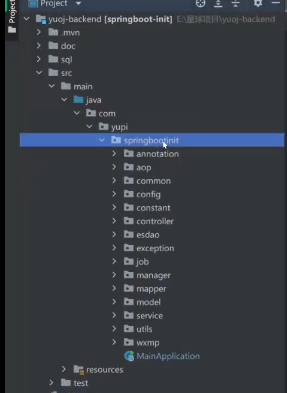

选中部分点击全局适用，改名为yuoj

### 2、src-resource 文件夹下MainApplication
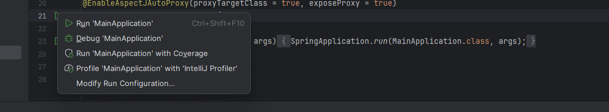

debug启动！

### 3、导入数据库
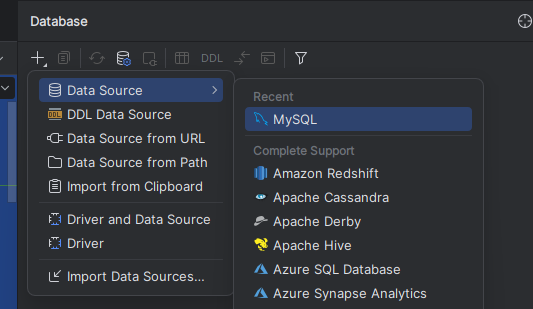

Apply-OK
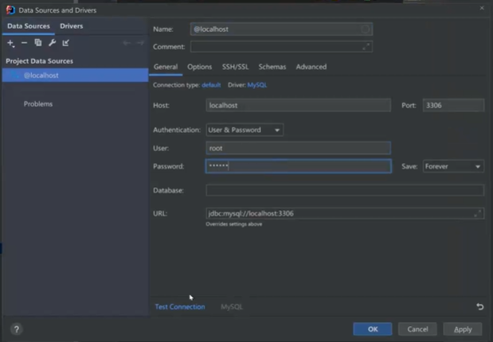

sql-create_table.sql

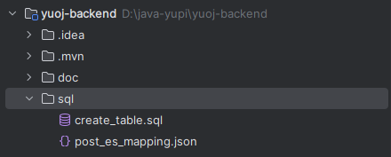

将数据库名称修改为自己的名称
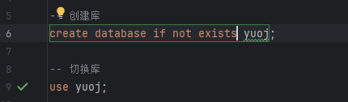

全选，点击运行

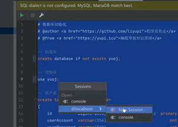

application.yml改变url中的库名

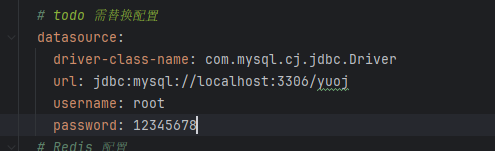

### 4、是否加索引
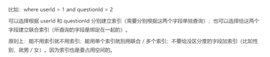

### 5、代码生成方法（自动生成对数据库的基本增删改查mapper和service层的基本功能）
（1） settings-plugins-install 安装MybatisX插件
（2）根据项目调整生成配置
选中需要生成的表，右键-MybatisX Generator；如法炮制每一个需要生成的表
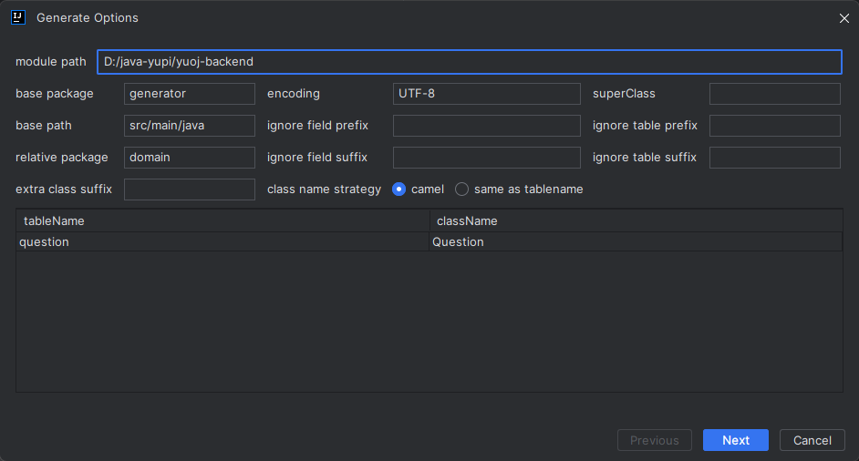
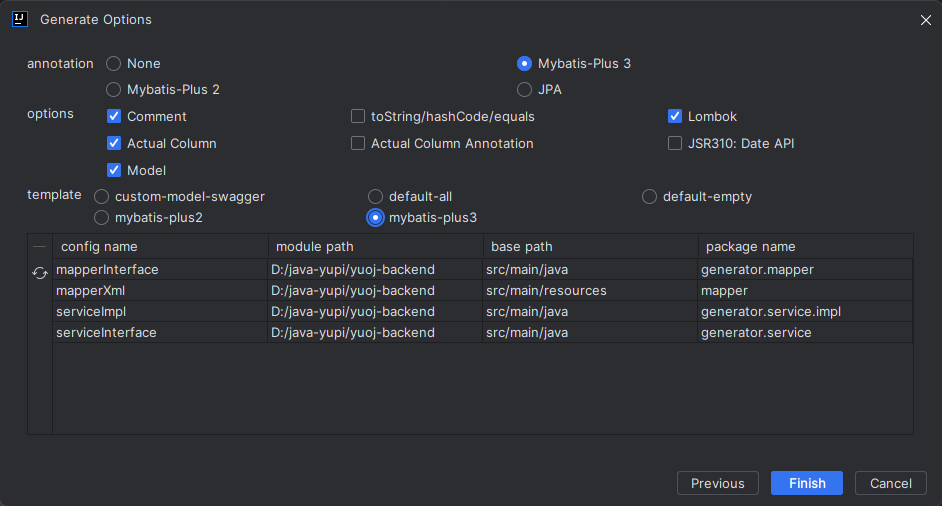
(3)在生成的generator文件夹中，将对应的文件转到项目中，这个过程全部点击重构
domain文件夹下复制到model-entity;
mapper-mapper;
service-service;
service/impl-service/impl;
之后可以删除生成的generator文件夹

### 6、controller层
找相似的代码去复制Controller
（1）在controller层直接复制一个相似的文件，Ctrl+R全局替换相关内容，如表名（需要区分大小写，点旁边的两个c形状的按钮）
post替换为question
Post替换为Question
帖子替换为题目

（2）单表查询去复制单表，如Question=>post;
关联表去复制关联表，Question_Submit=>PostThumb;

### 7、编写DTO数据传输对象接口
（1）在model/dto文件夹下新建相关的CRUD操作，如针对与question表建立一个新的文件夹question，在model/dto/post中找到四个CRUD操作的文件粘贴；
改一下对应的函数名和文件名；

（2）复制过来的文件还要改里面的操作。可以在model/entity文件夹里面对应找到Question（你要用的这个表的
各种操作，把其中的函数体复制过来覆盖掉原有的函数体

具体函数体示例：
```agsl
 /**
     * id
     */
    @TableId(type = IdType.AUTO)
    private Long id;

    /**
     * 标题
     */
    private String title;

    /**
     * 内容
     */
    private String content;

    /**
     * 标签列表（json 数组）
     */
    private String tags;

    /**
     * 题目答案
     */
    private String answer;

    /**
     * 题目提交数
     */
    private Integer submitNum;

    /**
     * 题目通过数
     */
    private Integer acceptNum;

    /**
     * 判题用例(json 数组)
     */
    private String judgeCase;

    /**
     * 判题配置(json 对象)
     */
    private String judgeConfig;

    /**
     * 点赞数
     */
    private Integer thumbNum;

    /**
     * 收藏数
     */
    private Integer favourNum;

    /**
     * 创建用户 id
     */
    private Long userId;

    /**
     * 创建时间
     */
    private Date createTime;

    /**
     * 更新时间
     */
    private Date updateTime;

    /**
     * 是否删除
     */
    private Integer isDelete;

    @TableField(exist = false)
    private static final long serialVersionUID = 1L;
```

```
后端启动测试地址：http://localhost:8121/api/doc.html#/home
后端打印：System.out.println("User ID: " + userId);

1.QuestionServiceImpl.java(QuestionVO.objToVo)->QuestionVO.java
2.先看controller，doQuestionSubmit方法缺少QuestionSubmitAddRequest方法->questionsubmit包
->create QuestionSubmitAddRequest(复制任意AddRequest后缀的文件修改名字)->entity表示实体类，
具体看用户要提交submit需要什么操作,直接将entity/QuestionSubmit里所有实体类粘到QuestionSubmitAddRequest，
看哪些需要前端传，删去一些不必要的类->回到QuestionSubmitController，（getxx）后面的xx是代表QuestionSubmitAddRequest
中的实体类->按照代码流程，实现service层->同样找到类似的Service后缀，复制参数到QuestionSubmitService，改名
->QuestionSubmitServiceImpl(同样找相同后缀复制)
3.枚举
enums->QuestionSubmitStatusEnum（复制类似的，替换枚举值。其他不用改
4.回到QuestionSubmitServiceImpl，根据用户值来枚举

5.QuestionSubmitController层写一个Query接口，先要创建一个QuestionSubmitQueryRequest文件，包含指定的变量,(继续编写
service类，这一步不知道要干嘛)
QuestionSubmitServiceImpl->QuestionSubmitVO。VO是封装类，需要给前端返回哪些字段，就是需要哪些类

6 首先从control层拿到数据变量后favorname
```

```
###代码沙箱部分
1.编写接口CodeSandbox
2.实现接口，在CodeSandbox，选择该接口alt+enter 选implement interface，一路ok，直接构建impl的接口类
3.编写测试类，在CodeSandbox，选择该接口alt+enter 选Create Test 
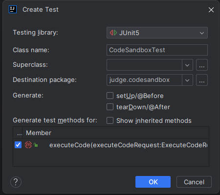
记得打勾

```


